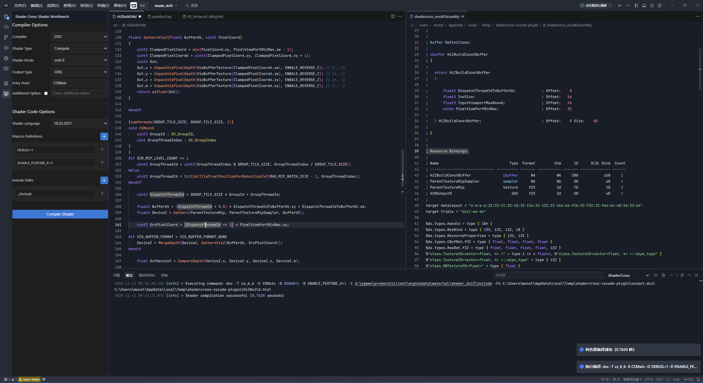

# ShaderCross VSCode 插件

## 插件用途

ShaderCross是一个强大的VSCode扩展，专为着色器开发人员设计，提供跨平台着色器编译和转换功能。该插件集成了多种专业着色器编译器，使用户能够在VSCode环境中无缝进行着色器开发、编译和调试工作。
该工程的代码大部分由AI生成。

主要功能：
- **着色器交叉编译**：使用DXC、FXC和GLSLang等编译器在不同着色语言(HLSL、GLSL)之间进行转换
- **多种着色器类型支持**：支持顶点着色器、像素着色器、几何着色器、计算着色器等多种着色器类型
- **实时预览**：直接在VSCode中查看编译结果和反汇编代码
- **代码导航**：在反汇编输出中快速定位和高亮显示特定代码段
- **智能选项限制**：根据所选编译器自动限制和调整可用选项，避免配置错误

## 界面介绍

ShaderCross插件提供了一个直观的侧边栏界面，通过VSCode的活动栏可以访问。界面包含以下主要组件：

1. **编译器选择器**：允许用户在DXC、FXC和GLSLang编译器之间进行切换
2. **着色器类型选择**：支持多种着色器类型，包括顶点着色器、像素着色器、几何着色器、计算着色器等
3. **着色器模型选择**：根据所选编译器提供相应的着色器模型选项
4. **输出类型选择**：允许选择不同的编译输出格式
5. **入口点设置**：配置着色器的入口函数名称
6. **宏定义管理**：添加、删除和编辑着色器宏定义
7. **包含路径管理**：管理着色器编译所需的包含文件路径
8. **编译按钮**：触发着色器编译过程，编译期间显示"Building"状态

界面特点：
- 根据所选编译器智能调整可用选项，避免无效配置
- 直观的错误提示和编译状态反馈
- 支持保存和恢复用户配置
- 符合VSCode主题的界面风格，提供良好的视觉体验



## 安装VSIX文件

### 方法一：从VSIX文件安装
1. 下载shadercross-*.vsix文件，可以直接从Github Releases页面下载最新版本
2. 在VSCode中，点击扩展图标（侧边栏中的方块图标）
3. 点击扩展面板右上角的省略号（...）图标
4. 选择"从VSIX安装..."
5. 浏览并选择下载的VSIX文件
6. VSCode将安装扩展并提示重新加载窗口

### 方法二：通过命令行安装
1. 打开命令行工具
2. 运行以下命令：
   ```bash
   code --install-extension build_output/shadercross-0.1.0.vsix
   ```
3. VSCode将安装扩展并提示重新加载窗口

## 编译当前工程

### 环境初始化

1. **安装Node.js**：
   - 访问[Node.js官方下载页面](https://nodejs.cn/download/)
   - 下载并安装Node.js（推荐v18或更高版本）
   - 安装完成后，通过命令行验证安装：
     ```bash
     node -v
     npm -v
     ```

2. **安装VSCode**：
   - 访问[VSCode官方网站](https://code.visualstudio.com/)
   - 下载并安装适合您操作系统的VSCode版本

3. **安装扩展开发工具**：
   ```bash
   npm install -g yo generator-code
   npm install -g vsce
   ```

### 依赖安装

1. **克隆或下载项目**后，进入shadercross目录：
   ```bash
   cd shadercross
   ```

2. **安装项目依赖**：
   ```bash
   npm install
   ```

3. **验证开发依赖**：项目依赖包含在package.json中，主要包括：
   - @types/vscode - VSCode类型定义
   - eslint - 代码质量检查工具
   - vsce - VSCode扩展打包工具
   - vscode-test - VSCode扩展测试工具

### 编译和打包

1. **测试插件**：
   - 在VSCode中打开项目
   - 按F5启动调试会话
   - 这将打开一个新的VSCode窗口，加载并运行插件

2. **打包插件**：
   - 进入shadercross目录
   - 运行以下命令：
     ```bash
     npm run package
     ```
   - 或直接运行：
     ```bash
     vsce package
     ```
   - 这将在build_output目录中生成一个新的VSIX文件

3. **使用批处理脚本**：
   - 项目根目录提供了`build_plugin.bat`脚本
   - 双击运行该脚本，将自动执行打包过程并生成VSIX文件到build_output目录

## 注意事项

- 插件内置了DXC、FXC、GLSLang和SPIRV-Cross编译器，无需额外安装
- 部分高级着色器功能可能在所有编译器组合中不完全支持
- 性能可能因着色器复杂度和系统资源而异
- VSCode版本要求：1.96.0或更高版本

## 许可证

MIT License